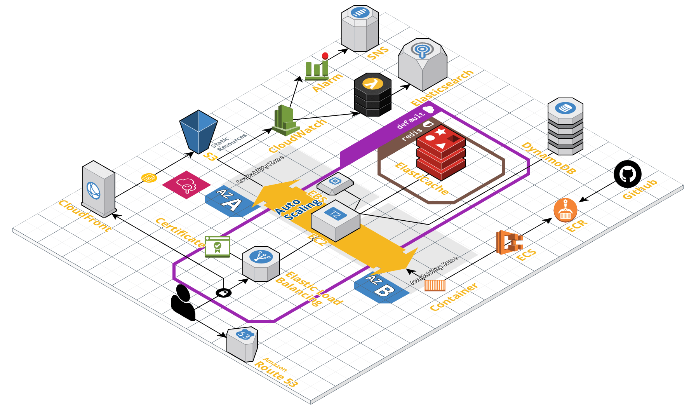

# Ptt Alertor AWS Cloudformation

## Architecture


<https://cloudcraft.co/view/7314db72-b1f6-4f49-b773-c3a11d4ed92b?key=tulQtXdlKJ2FIbHoaHqTzQ>

## [Command](http://docs.aws.amazon.com/cli/latest/reference/cloudformation/index.html#cli-aws-cloudformation)

* Validate Stack

  ```bash
  aws cloudformation validate-template --template-body file://./s3/s3.json
  ```

* Create Stack

  ```bash
  aws cloudformation create-stack --capabilities CAPABILITY_IAM --stack-name Production-S3 --template-body file://./s3/s3.json
  ```

* Update Stack

  ```bash
  aws cloudformation update-stack --capabilities CAPABILITY_IAM --stack-name Production-S3 --template-body file://./s3/s3.json
  ```

## Steps

* [x] Create AWS Account by new Email
* [x] Create IAM User: *deploy* with Administrator Access Permission
* [x] [Configure AWS CLI](https://docs.aws.amazon.com/en_us/cli/latest/userguide/cli-chap-getting-started.html)
* [x] Use deploy to create IAM stack
* [x] Re-configure AWS CLI as your own IAM user
* [x] Create Stack in order
  * [x] s3
    * [x] new s3 bucket name
    * [x] migrate s3 folders and files
  * [x] vpc
  * [x] ecr
  * [x] ecs-cluster
  * [x] ecs-hosts
    * [x] update AMI
    * [x] create key pair `aws ec2 create-key-pair --key-name ecs`
  * [x] redis
  * [x] acm
    * [x] Certificate Approval
  * [x] service-ptt-alertor
    * [x] push image on ECR
  * [x] sns
  * [x] cloudwatch
    * [x] copy dashboard source from console to `dashboard.yml`
  * [x] elasticsearch
    * [x] migrate elasticsearch and kibana setting
* [x] stop service in former account
  * [x] update ECS Service's Number of tasks to 0
  * [x] docker stop container
* [x] migrate redis db
* [x] DNS change
* [x] setting travis ci
  * [x] AWS_ACCESS_KEY_ID
  * [x] AWS_SECRET_ACCESS_KEY in secure
  * [x] AWS_Docker_Repo
* [x] delete former account stacks